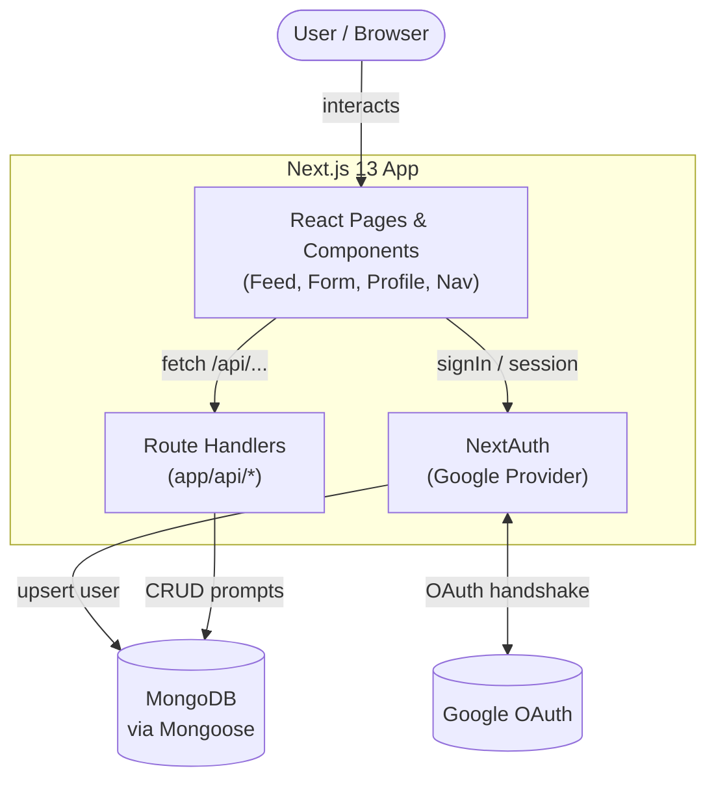
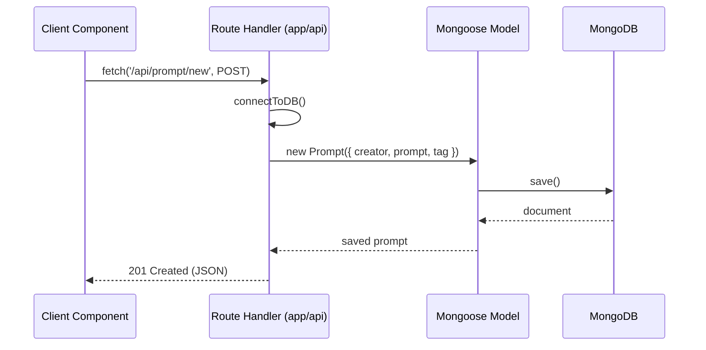
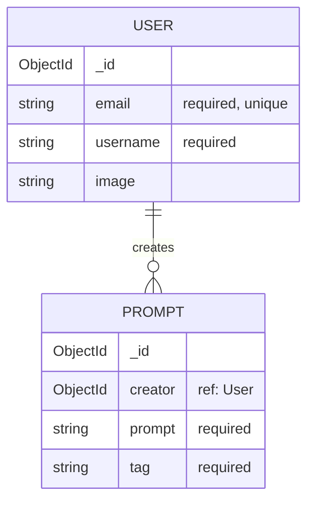

# Prompt-O-Phobia

> An open-source platform for discovering, creating, and sharing AI prompts with the world.

Prompt-O-Phobia is a community-driven web application where users sign in with Google, publish their best AI prompts (tagged by topic), browse a global feed, search by author or tag, and manage their own collection. It is built on the **Next.js 13 App Router** with a **MongoDB** backend and **Google OAuth** authentication.

---

## Table of Contents

- [Overview](#overview)
- [Features](#features)
- [Tech Stack](#tech-stack)
- [Architecture](#architecture)
- [Project Structure](#project-structure)
- [Prerequisites](#prerequisites)
- [Installation](#installation)
- [Environment Variables](#environment-variables)
- [Development](#development)
- [Build](#build)
- [Testing](#testing)
- [Database](#database)
- [API Documentation](#api-documentation)
- [Deployment](#deployment)
- [Troubleshooting](#troubleshooting)
- [Contributing](#contributing)
- [License](#license)

---

## Overview

Prompt-O-Phobia solves a simple but real problem: **good AI prompts are hard to find and easy to lose.** The app gives users a shared, searchable home for prompt engineering ideas.

**Target users:** Prompt engineers, AI enthusiasts, writers, developers, and anyone experimenting with generative-AI tools who wants to discover proven prompts or share their own.

**Core workflow:**

1. A visitor lands on the home feed and browses/searches all community prompts — no account required to read.
2. To contribute, the user signs in with their Google account (NextAuth + Google OAuth).
3. On first sign-in, a user record is created automatically in MongoDB.
4. The user creates a prompt with a body and a tag (e.g. `#productivity`).
5. Prompts appear in the global feed, are searchable by tag/username/content, and can be copied to the clipboard with one click.
6. From their profile, the user can edit or delete their own prompts. They can also click any author to view that creator's public profile and prompts.

---

## Features

- 🔐 **Google OAuth authentication** via NextAuth.js — sessions, sign-in/out, and auto-provisioning of users on first login.
- 📝 **Full CRUD for prompts** — create, read, update, and delete, with ownership enforced in the UI.
- 🌐 **Global prompt feed** — every published prompt rendered as a card with creator, content, and tag.
- 🔎 **Live search** — debounced, case-insensitive filtering by tag, username, or prompt content.
- 🏷️ **Tag-based discovery** — click any tag to instantly filter the feed.
- 📋 **One-click copy** — copy a prompt to the clipboard with visual confirmation.
- 👤 **Public & personal profiles** — view your own prompts (with edit/delete controls) or any other creator's prompts.
- 📱 **Responsive design** — dedicated desktop and mobile navigation, including a mobile dropdown menu.
- ⚡ **Server Components + Route Handlers** — leverages the Next.js 13 App Router for data fetching and API routes.

---

## Tech Stack

| Category | Technology |
| --- | --- |
| **Language** | JavaScript (JSX), ES Modules |
| **Framework** | [Next.js 13.4](https://nextjs.org/) (App Router, `experimental.appDir`) |
| **UI Library** | [React 18.2](https://react.dev/) |
| **Styling** | [Tailwind CSS 3.3](https://tailwindcss.com/), PostCSS, Autoprefixer |
| **Authentication** | [NextAuth.js 4.23](https://next-auth.js.org/) with Google Provider |
| **Database** | [MongoDB](https://www.mongodb.com/) |
| **ODM** | [Mongoose 7.4](https://mongoosejs.com/) |
| **Package Manager** | npm (`package-lock.json` present) |
| **Fonts** | Inter & Satoshi (custom Tailwind font families) |
| **Deployment (inferred)** | [Vercel](https://vercel.com/) |

> No testing framework, linter config beyond `next lint`, TypeScript, Docker, or CI/CD configuration was found in the repository (see [Testing](#testing) and [Deployment](#deployment)).

---

## Architecture

Prompt-O-Phobia is a single Next.js application that serves both the frontend (React Server/Client Components) and the backend (App Router Route Handlers under `app/api`). Mongoose connects to a MongoDB database, and NextAuth handles the Google OAuth flow.



**Request flow for a prompt action:**



**Key architectural notes:**

- **`utils/database.js`** maintains a module-level `isConnected` flag so the serverless function reuses an existing Mongoose connection instead of reconnecting on every invocation.
- **`next.config.js`** marks `mongoose` as a `serverComponentsExternalPackages` entry and enables `topLevelAwait` in webpack so the ODM works correctly in the server runtime.
- **Path alias `@*`** (configured in `jsconfig.json`) maps to the project root, enabling imports like `@components/Nav` and `@utils/database`.

---

## Project Structure

```
prompt-o-phobia/
├── app/                          # Next.js App Router (routes + API)
│   ├── api/
│   │   ├── auth/[...nextauth]/    # NextAuth Google OAuth handler
│   │   ├── prompt/
│   │   │   ├── route.js           # GET all prompts
│   │   │   ├── new/route.js       # POST create prompt
│   │   │   └── [id]/route.js      # GET / PATCH / DELETE single prompt
│   │   └── users/[id]/posts/      # GET prompts by a given user
│   ├── create-prompt/page.jsx     # Create-prompt page
│   ├── update-prompt/page.jsx     # Edit-prompt page
│   ├── profile/
│   │   ├── page.jsx               # "My profile" (own prompts, edit/delete)
│   │   ├── [id]/page.jsx          # Another user's public profile
│   │   └── loading.jsx            # Route-level loading spinner
│   ├── layout.jsx                 # Root layout (Nav + SessionProvider)
│   └── page.jsx                   # Home page (hero + Feed)
├── components/
│   ├── Feed.jsx                   # Feed + debounced search
│   ├── Form.jsx                   # Shared create/edit form
│   ├── Nav.jsx                    # Responsive navigation + auth controls
│   ├── Profile.jsx                # Profile prompt grid
│   ├── PromptCard.jsx             # Single prompt card (copy, tag, edit/delete)
│   └── Provider.jsx               # NextAuth SessionProvider wrapper
├── models/
│   ├── prompt.js                  # Mongoose Prompt schema
│   └── user.js                    # Mongoose User schema
├── utils/
│   └── database.js                # Cached Mongoose connection helper
├── styles/globals.css             # Global + Tailwind styles
├── public/assets/                 # Public icons & images
├── assets/                        # Source icons & images
├── next.config.js                 # Next.js configuration
├── tailwind.config.js             # Tailwind theme (colors, fonts)
├── postcss.config.js              # PostCSS plugins
├── jsconfig.json                  # Path alias config (@* → ./*)
└── package.json
```

---

## Prerequisites

Before you begin, make sure you have:

- **Node.js** ≥ 18 (recommended for Next.js 13).
- **npm** (bundled with Node.js).
- A **MongoDB** database — a free [MongoDB Atlas](https://www.mongodb.com/atlas) cluster works well, or a local `mongod` instance.
- A **Google Cloud OAuth 2.0 Client** (Client ID + Secret) configured with an authorized redirect URI of `http://localhost:3000/api/auth/callback/google` for local development.

---

## Installation

```bash
# 1. Clone the repository
git clone <repository-url>
cd prompt-o-phobia

# 2. Install dependencies
npm install

# 3. Create your environment file (see next section)
#    Create a file named .env in the project root and fill in the values

# 4. Start the development server
npm run dev
```

Then open [http://localhost:3000](http://localhost:3000).

---

## Environment Variables

Create a `.env` file in the project root. `.env` and `*.env` files are git-ignored.

| Variable | Required | Description |
| --- | --- | --- |
| `MONGODB_URI` | ✅ Yes | MongoDB connection string. The app connects to a database named `prompt-o-phobia` (set in `utils/database.js`). |
| `GOOGLE_CLIENT_ID` | ✅ Yes | Google OAuth 2.0 Client ID used by the NextAuth Google provider. |
| `GOOGLE_CLIENT_SECRET` | ✅ Yes | Google OAuth 2.0 Client Secret. |
| `NEXTAUTH_URL` | ✅ Yes _(inferred)_ | Base URL of the app, e.g. `http://localhost:3000` locally. Required by NextAuth for correct OAuth callbacks. |
| `NEXTAUTH_SECRET` | ⚠️ Recommended _(inferred)_ | Secret used by NextAuth to encrypt JWT/session tokens. Required in production. Generate with `openssl rand -base64 32`. |

> **Inferred entries:** `NEXTAUTH_URL` and `NEXTAUTH_SECRET` are not referenced directly in the source but are standard, effectively-required NextAuth variables. `MONGODB_URI`, `GOOGLE_CLIENT_ID`, and `GOOGLE_CLIENT_SECRET` are read directly in the code.

Example `.env`:

```bash
MONGODB_URI="mongodb+srv://<user>:<password>@<cluster>.mongodb.net/?retryWrites=true&w=majority"
GOOGLE_CLIENT_ID="your-google-client-id.apps.googleusercontent.com"
GOOGLE_CLIENT_SECRET="your-google-client-secret"
NEXTAUTH_URL="http://localhost:3000"
NEXTAUTH_SECRET="your-generated-secret"
```

---

## Development

Start the local development server with hot reloading:

```bash
npm run dev
```

The app runs at [http://localhost:3000](http://localhost:3000) and auto-updates as you edit files. Images from `lh3.googleusercontent.com` (Google profile pictures) are whitelisted in `next.config.js`.

---

## Build

Create an optimized production build and run it:

```bash
# Build for production
npm run build

# Start the production server (after building)
npm run start
```

### Available Scripts

| Script | Command | Description |
| --- | --- | --- |
| `dev` | `next dev` | Runs the app in development mode with hot reloading. |
| `build` | `next build` | Produces an optimized production build. |
| `start` | `next start` | Serves the production build (run after `build`). |
| `lint` | `next lint` | Runs Next.js' built-in ESLint checks. |

> **Note:** No `migrate`, `seed`, `test`, or `format` scripts are defined in `package.json`.

---

## Testing

No automated test suite or testing framework (Jest, Vitest, Playwright, Cypress, etc.) is configured in this repository. Testing is currently **manual**. Linting is available via:

```bash
npm run lint
```

Contributions adding a test framework are welcome — see [Contributing](#contributing).

---

## Database

The app uses **MongoDB** accessed through **Mongoose**. Connections are established lazily inside each route handler via `connectToDB()` (`utils/database.js`), which caches the connection across invocations and targets the `prompt-o-phobia` database.

### Data Model



**Entities:**

- **User** (`models/user.js`) — `email` (required, unique), `username` (required), and `image` (Google avatar URL). Users are created automatically on first Google sign-in.
- **Prompt** (`models/prompt.js`) — `creator` (reference to a `User`), `prompt` text (required), and `tag` (required). Queries use Mongoose `.populate('creator')` to embed author details.

### Migrations & Seeding

There are **no migration or seed scripts**. Mongoose creates collections implicitly on first write, and schemas are enforced at the application level. To seed data, create prompts through the UI after signing in.

---

## API Documentation

All endpoints are implemented as Next.js App Router Route Handlers under `app/api`. Responses are JSON (or plain-text error messages). There is no token-based API auth on the prompt routes themselves — the `creator`/`userId` is supplied by the client based on the NextAuth session.

### Authentication

| Method | Endpoint | Description |
| --- | --- | --- |
| `GET` / `POST` | `/api/auth/[...nextauth]` | NextAuth handler for Google OAuth (sign-in, callback, session, sign-out). On first sign-in a `User` document is created; the `session` callback attaches the Mongo `_id` to `session.user.id`. |

### Prompts

| Method | Endpoint | Description |
| --- | --- | --- |
| `GET` | `/api/prompt` | Returns all prompts, each populated with its creator. |
| `POST` | `/api/prompt/new` | Creates a new prompt. Body: `{ userId, prompt, tag }`. Returns `201` with the created document. |
| `GET` | `/api/prompt/:id` | Returns a single prompt (populated with creator). `404` if not found. |
| `PATCH` | `/api/prompt/:id` | Updates a prompt's `prompt` and `tag`. Body: `{ prompt, tag }`. |
| `DELETE` | `/api/prompt/:id` | Deletes the prompt with the given id. |

### Users

| Method | Endpoint | Description |
| --- | --- | --- |
| `GET` | `/api/users/:id/posts` | Returns all prompts created by the given user id (populated with creator). |

### Example: Create a Prompt

```bash
curl -X POST http://localhost:3000/api/prompt/new \
  -H "Content-Type: application/json" \
  -d '{
    "userId": "664f1a2b3c4d5e6f7a8b9c0d",
    "prompt": "Act as a senior code reviewer and critique the following function...",
    "tag": "coding"
  }'
```

### Example: Fetch All Prompts

```bash
curl http://localhost:3000/api/prompt
```

---

## Deployment

No deployment manifests (Dockerfile, `docker-compose`, Kubernetes, or CI workflow) are present. Given the Next.js stack and the `.vercel` entry in `.gitignore`, **Vercel is the inferred deployment target.**

**To deploy on Vercel:**

1. Push the repository to GitHub/GitLab/Bitbucket.
2. Import the project into [Vercel](https://vercel.com/new).
3. Add the environment variables from the [Environment Variables](#environment-variables) section to the Vercel project settings.
4. Set `NEXTAUTH_URL` to your production URL and add the production OAuth callback (`https://<your-domain>/api/auth/callback/google`) to your Google Cloud credentials.
5. Deploy — Vercel auto-detects Next.js and runs `next build`.

The app can also be self-hosted by running `npm run build && npm run start` behind a reverse proxy on any Node.js host.

---

## Troubleshooting

| Issue | Likely Cause & Fix |
| --- | --- |
| **MongoDB connection errors** | Check `MONGODB_URI` is correct and your IP is allow-listed in MongoDB Atlas (Network Access). |
| **Google sign-in fails / redirect mismatch** | Ensure the OAuth redirect URI in Google Cloud matches `<base-url>/api/auth/callback/google`, and that `GOOGLE_CLIENT_ID`/`GOOGLE_CLIENT_SECRET` are set. |
| **`NEXTAUTH_URL` / session issues** | Set `NEXTAUTH_URL` to the exact app URL and define `NEXTAUTH_SECRET` (especially in production). |
| **Profile images not loading** | Google avatars come from `lh3.googleusercontent.com`, which is whitelisted in `next.config.js`. Add any new external image domains there. |
| **Changes to `.env` not applied** | Restart the dev server after editing environment variables. |
| **`mongoose` build/runtime errors** | `mongoose` is declared in `serverComponentsExternalPackages` in `next.config.js`; keep it there so it runs in the Node server runtime. |

---

## Contributing

Contributions are welcome! This is an open-source project.

1. Fork the repository and create a feature branch: `git checkout -b feature/your-feature`.
2. Make your changes and run `npm run lint` to keep the code clean.
3. Commit with a clear message and push your branch.
4. Open a Pull Request describing your change.

Helpful areas to contribute: adding a test framework, server-side authorization on prompt mutations, input validation, TypeScript migration, and pagination for the feed.

---

## License

License information not found. No `LICENSE` file or `license` field (in `package.json`) was present in the repository. Please add a license before public distribution.
